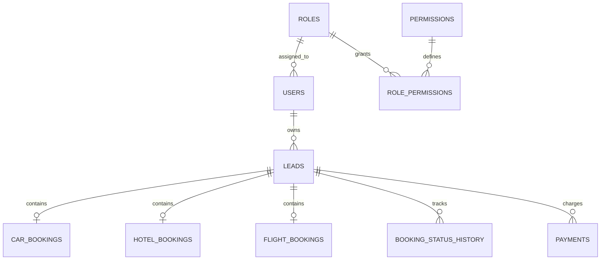

# Database Schema & Master Entities

## 1. Overview
The database uses PostgreSQL with asyncpg driver. All core entities inherit from `UUIDPKMixin` and `AuditMixin` for consistent UUID primary keys and audit tracking:
- `id`: `UUID` (Primary Key)
- `created_by`: `UUID -> users.id` (Nullable)
- `created_on`: `TIMESTAMPTZ` (Server default `now()`)
- `modified_by`: `UUID -> users.id` (Nullable)
- `modified_on`: `TIMESTAMPTZ` (Auto updated `now()`)
- `is_active`: `BOOLEAN` (Default `true`)
- `is_deleted`: `BOOLEAN` (Default `false` for soft-deletion)

---

## 2. Core Entities

### Core Tables
1. **`users`**: User accounts with password hashes, role assignment, active flag, and per-user IP whitelist settings.
2. **`roles`**, **`permissions`**, **`role_permissions`**: Dynamic RBAC engine allowing runtime role and permission changes without redeployment.
3. **`leads`**: Central CRM lead records with `service_type` (`car`, `hotel`, `flight`), status, assigned agent, and customer contact information.
4. **`car_bookings`**: Car rental specifics (pickup/return datetime, locations, car provider, model, rate breakdown).
5. **`hotel_bookings`**: Hotel reservation properties, room types, bed types, check-in/out dates, guest rosters.
6. **`flight_bookings`**: Airline PNR, cabin class, passenger roster, itinerary segments.
7. **`app_settings`**: Typed key-value store for global settings (e.g. `security.ip_whitelist_enabled`, `security.allowed_ips`, `header_clocks`).

---

## 3. Dedicated Master Tables (`mst_*`)
The schema features 24 dedicated master tables to power all booking and CRM dropdown menus dynamically:
1. `mst_booking_platform`
2. `mst_leads_booking_source`
3. `mst_title`
4. `mst_lead_tag`
5. `mst_insurance_coverage`
6. `mst_transmission`
7. `mst_vehicle_type`
8. `mst_car_provider`
9. `mst_fuel_policy`
10. `mst_mileage`
11. `mst_card_type`
12. `mst_flight_sub_category`
13. `mst_charge_name`
14. `mst_payment_method`
15. `mst_room_type`
16. `mst_bed_type`
17. `mst_hotel_name`
18. `mst_airline`
19. `mst_cabin_class`
20. `mst_trip_type`
21. `mst_booking_type`
22. `mst_ticket_status`
23. `mst_supplier_portal`
24. `mst_flight_portal`

---

## 4. Alembic Migrations
Migrations are stored in `alembic/versions/`:
- `alembic upgrade head`: Applies all pending migrations up to the latest revision (`0023_seed_all_master_tables`).
- `alembic revision -m "description"`: Creates a new migration script.
